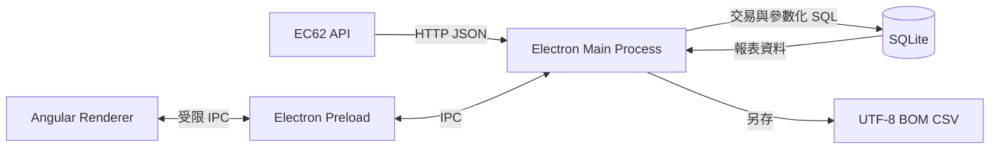
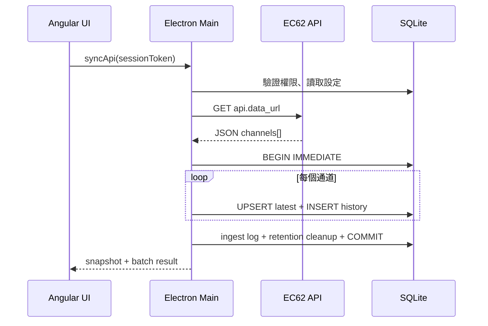
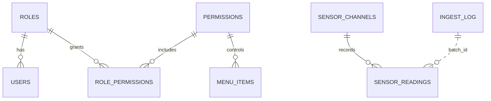

# E62 Dashboard 系統與 SQLite 資料庫設計文件

| 項目 | 內容 |
|---|---|
| 文件版本 | 1.0 |
| 適用程式 | E62 Angular Dashboard 1.0.0 |
| 技術 | Angular 20、Electron、Node.js `node:sqlite`、SQLite 3 |
| 狀態 | 對應目前實作；文中「建議」為正式上線改善項目 |

## 1. 目的與範圍

系統從 EC62 API 或內建模擬資料取得通道快照，保存至 SQLite，提供即時儀錶板、歷史報表、條件查詢、CSV 匯出、應用設定、帳號、角色、權限及菜單管理。

SQLite 適合目前的單機桌面部署，不需要額外安裝資料庫服務。若未來要多台電腦共用、多人同時寫入或集中管理，應改用 PostgreSQL／SQL Server 等伺服器型資料庫，不建議多台電腦直接共用網路磁碟上的 SQLite 檔案。

## 2. 系統架構



- Angular Renderer 不直接開啟資料庫，也不能執行任意 SQL。
- Preload 只公開白名單 `window.e62Db` 方法。
- Main Process 負責登入、權限檢查、API 呼叫、交易、查詢及匯出。
- 應用設定、帳號、角色、權限與菜單均從 SQLite 取得。

## 3. 資料庫位置與模式

```text
%APPDATA%\angular-dashboard\data\e62-dashboard.sqlite3
```

一般實際路徑格式為 `C:\Users\<Windows帳號>\AppData\Roaming\angular-dashboard\data\e62-dashboard.sqlite3`。

| PRAGMA | 值 | 用途 |
|---|---:|---|
| `journal_mode` | `WAL` | 降低寫入阻塞讀取的機率 |
| `foreign_keys` | `ON` | 啟用外鍵約束 |
| `synchronous` | `NORMAL` | 效能與耐久性平衡 |

WAL 模式運行時可能同時出現 `.sqlite3-wal` 與 `.sqlite3-shm`，不可在程式運行時只複製主檔作為完整備份。

## 4. 寫入與查詢流程

API／模擬資料寫入：

1. 驗證 session 及 `dashboard.view` 權限。
2. Live 模式從 `app_settings` 讀取 API URL 與 Token；Mock 模式接收模擬快照。
3. 確認回應含非空 `channels` 陣列，產生 UUID `batch_id`。
4. `BEGIN IMMEDIATE` 開始單一交易。
5. 每個通道 UPSERT `sensor_channels` 最新狀態，並 INSERT 一筆 `sensor_readings` 歷史值。
6. 寫入成功的 `ingest_log`，依保留天數刪除過期歷史資料。
7. 全部成功才 `COMMIT`；任一錯誤即 `ROLLBACK`，不留下半批資料。



報表從 `sensor_readings` JOIN `sensor_channels` 查詢，可依通道／名稱、狀態及日期篩選。畫面一次最多 1,000 筆並支援 offset；CSV 會以相同條件重新查詢全部符合資料，不只匯出目前頁面。

## 5. ER 關聯



`ingest_log.batch_id` 與 `sensor_readings.batch_id` 目前為邏輯關聯，未設外鍵，以允許兩類資料採不同保留策略。

## 6. 資料表字典

### `app_settings` — 應用設定

| 欄位 | 型別／限制 | 說明 |
|---|---|---|
| `key` | TEXT PK | 設定唯一代碼 |
| `value_json` | TEXT NOT NULL | JSON 值，可保存字串、數字、布林 |
| `category` | TEXT NOT NULL | API、報表、顯示等分類 |
| `description` | TEXT NOT NULL | 設定說明 |
| `updated_at` | TEXT NOT NULL | 最後更新時間 |

### `roles`、`permissions`、`role_permissions`

| 資料表 | 欄位 | 說明 |
|---|---|---|
| `roles` | `id` PK、`code` UNIQUE、`display_name`、`description`、`is_system` | 系統角色 |
| `permissions` | `id` PK、`code` UNIQUE、`display_name`、`description` | 功能權限代碼 |
| `role_permissions` | `role_id` FK、`permission_id` FK，複合 PK | 角色與權限多對多；刪除主檔時級聯刪除 |

### `users` — 使用者

| 欄位 | 型別／限制 | 說明 |
|---|---|---|
| `id` | INTEGER PK AUTOINCREMENT | 使用者 ID |
| `username` | TEXT UNIQUE NOCASE | 登入帳號，不分大小寫 |
| `display_name` | TEXT NOT NULL | 顯示名稱 |
| `password_hash` | TEXT NOT NULL | `scrypt:salt:hash`，不保存明文 |
| `role_id` | INTEGER FK NOT NULL | 對應角色 |
| `channel_scope` | TEXT NOT NULL | 通道範圍；目前僅保存，尚未套用 SQL 過濾 |
| `active` | INTEGER NOT NULL | 1 啟用、0 停用 |
| `created_at`／`updated_at` | TEXT NOT NULL | 建立／更新時間 |

### `menu_items` — 菜單

| 欄位 | 說明 |
|---|---|
| `id` | INTEGER PK |
| `menu_key` | 唯一菜單代碼 |
| `label`、`icon`、`route` | 顯示文字、圖示與 Angular view key |
| `sort_order`、`enabled` | 顯示順序及開關 |
| `required_permission` | 顯示菜單所需權限代碼，可為空 |

### `sensor_channels` — 最新通道狀態

| 欄位 | 型別／限制 | 說明 |
|---|---|---|
| `channel_id` | TEXT PK | 通道代碼，寫入時至少補至三位 |
| `name` | TEXT NOT NULL | 通道名稱 |
| `sv` | REAL NULL | 設定值 |
| `alarm_low`／`alarm_high` | REAL NULL | 警報上下限 |
| `last_pv` | REAL NULL | 最新測量值 |
| `last_state` | TEXT NOT NULL | `ok`、`alarm`、`error` |
| `last_seen_at` | TEXT NULL | 最新設備資料時間，ISO 8601 |
| `raw_json` | TEXT NOT NULL | API 原始通道 JSON |
| `updated_at` | TEXT NOT NULL | 最新更新時間 |

### `sensor_readings` — 歷史讀值

| 欄位 | 型別／限制 | 說明 |
|---|---|---|
| `id` | INTEGER PK AUTOINCREMENT | 流水號 |
| `batch_id` | TEXT NOT NULL | 同一快照共用 UUID |
| `channel_id` | TEXT FK NOT NULL | 對應最新通道主檔 |
| `pv`／`sv` | REAL NULL | 當時測量值／設定值 |
| `state` | TEXT NOT NULL | 當時狀態 |
| `alarm_low`／`alarm_high` | REAL NULL | 當時警報上下限 |
| `recorded_at` | TEXT NOT NULL | 設備／快照時間，ISO 8601 UTC |
| `received_at` | TEXT NOT NULL | 本機接收時間 |
| `source` | TEXT NOT NULL | `api` 或 `mock` |
| `raw_json` | TEXT NOT NULL | 當時原始 JSON |

### `ingest_log` — 匯入批次

| 欄位 | 說明 |
|---|---|
| `id` | INTEGER PK |
| `batch_id` | UNIQUE 批次 UUID |
| `source`、`source_url` | 資料來源與 API URL |
| `channel_count`、`received_at` | 通道數與接收時間 |
| `status`、`error_message` | 成敗及錯誤訊息 |

目前成功批次寫入 `success`。失敗時整筆交易 rollback，錯誤回傳 UI，但不會永久寫入 `ingest_log`；若客戶需要完整稽核，建議 rollback 後以獨立交易補寫失敗紀錄。

## 7. 索引

| 索引 | 欄位 | 用途 |
|---|---|---|
| `idx_readings_recorded` | `recorded_at DESC` | 最新及日期區間查詢 |
| `idx_readings_channel_time` | `channel_id, recorded_at DESC` | 單通道趨勢 |
| `idx_readings_state_time` | `state, recorded_at DESC` | 警報／錯誤查詢 |

名稱查詢使用 `%關鍵字%`，一般索引無法有效加速前置萬用字元。大量資料若需快速名稱搜尋，可增加 FTS5 或改成前綴搜尋。

## 8. 設定字典

| Key | 型別 | 預設值 | 說明 |
|---|---|---|---|
| `data.mode` | string | `mock` | `mock` 或 `live` |
| `api.data_url` | string | `http://127.0.0.1:8080/api/data` | EC62 API URL |
| `api.auth_token` | string | 空白 | 非空時以 `X-EC62-Token` 傳送 |
| `api.poll_interval_ms` | number | `3000` | 同步間隔（毫秒） |
| `report.retention_days` | number | `365` | 歷史資料保留天數，最少 1 |
| `dashboard.show_status` | boolean | `true` | Header 狀態顯示 |
| `ui.default_view` | string | `overview` | 登入後預設畫面 |
| `notifications.enabled` | boolean | `true` | 桌面通知開關 |

設定只允許更新既有 key。`api.auth_token` 目前以 JSON 明文存在本機 SQLite；正式版若有秘密管理要求，建議改存 Windows Credential Manager／DPAPI。

## 9. 權限矩陣

| 權限 | Admin | Operator | Guest | 功能 |
|---|:---:|:---:|:---:|---|
| `dashboard.view` | ✓ | ✓ | ✓ | 儀錶板、同步 |
| `trends.view` | ✓ | ✓ | ✓ | 趨勢圖 |
| `reports.view` | ✓ | ✓ | ✓ | 報表查詢 |
| `reports.export` | ✓ | ✓ |  | CSV 匯出 |
| `alarms.view` | ✓ | ✓ | ✓ | 警報中心 |
| `alarms.ack` | ✓ | ✓ |  | 警報確認 |
| `users.manage` | ✓ |  |  | 帳號管理 |
| `settings.manage` | ✓ |  |  | 設定管理 |
| `tests.run` | ✓ | ✓ |  | 功能測試 |

登入後的 session token 只存在 Main Process 記憶體，關閉程式即失效。菜單隱藏不是唯一保護，每個敏感 IPC 都會再次驗證權限。

`channel_scope` 目前尚未做資料列層級授權；若客戶要求指定通道可見範圍，必須在最新資料、報表、匯出及警報的後端 SQL 一致套用，不能只靠前端隱藏。

## 10. API 資料契約

```json
{
  "schema_version": 1,
  "status_version": 1,
  "st_version": 2,
  "status": "connected",
  "collected_at": "2026-09-04T10:30:00+08:00",
  "channel_count": 1,
  "channels": [{
    "id": "01",
    "name": "CH01",
    "pv": 4.2,
    "sv": 4.0,
    "status": "ok",
    "st": 0
  }],
  "age_seconds": 2.5,
  "stale": false
}
```

- 預設 Live 端點為 `GET http://192.168.68.50:8088/api/v1/latest`；既有資料庫若仍使用舊預設網址，啟動時會自動移轉。
- 目前只接受 `schema_version: 1`、`status_version: 1`、`st_version: 2`。
- `channels` 必須為非空陣列；`id` 原樣保留且應固定、唯一；`channel_count` 必須與陣列數量相同。
- 數值欄位應為 number 或 `null`。
- `collected_at` 應用含時區 ISO 8601，並作為各通道的採集時間；無效時才使用本機目前 UTC。
- Live 模式使用 GET；有 Token 時傳送 `X-EC62-Token`。
- `channels[].status === 'read_error'`、`st === 2` 或 PV 缺值為 `error`；`st === 3`、本機警報或 PV 超限為 `alarm`；`st === 1` 是補傳保留碼，不單獨視為異常。
- API 不再提供的趨勢、MIN、MAX、AVG 與 COUNT 由 SQLite `sensor_readings` 歷史資料補齊。

## 11. 報表與 CSV

| 條件 | 行為 |
|---|---|
| `query` | 通道 ID 或目前通道名稱包含關鍵字 |
| `state` | `all` 或精確比對狀態 |
| `from`／`to` | 起日 00:00:00 至迄日 23:59:59.999 |
| `limit` | 1–1000，預設 50 |
| `offset` | 最小 0 |

排序為 `recorded_at DESC`，同時間再依通道 ID 數值排序。CSV 使用 UTF-8 BOM，欄位為通道、名稱、狀態、PV、SV、警報下限、警報上限、記錄時間、來源。文字若以 `= + - @` 開頭會加單引號，降低試算表公式注入風險。

目前匯出會一次查詢並在記憶體組成完整 CSV；大量匯出應改為分批查詢與串流寫檔，並限制日期範圍。

## 12. 容量與效能

```text
每日筆數 = 通道數 × 86,400,000 ÷ api.poll_interval_ms
```

200 通道、3 秒輪詢會產生 `5,760,000 筆／日`；保存 365 天理論上超過 21 億筆，不適合目前單機 SQLite 與一次刪除策略。正式上線前必須依實際通道數、頻率、raw JSON 大小及保留需求做容量測試。

建議擇一：即時畫面維持高頻更新但報表每 60–300 秒落庫；只在值／狀態變動或心跳時寫入；原始資料短期保存並建立小時／日彙總表；大規模需求改用伺服器型資料庫。清除應改為小批次，維護時可執行 `PRAGMA optimize`，需回收檔案空間時再於停機時段 `VACUUM`。

## 13. 備份、還原與升級

離線備份：關閉程式並確認程序結束，複製整個 `%APPDATA%\angular-dashboard\data` 資料夾，以日期命名且定期抽測還原。若必須在線備份，應使用 SQLite Backup API 或受控 checkpoint，不可只複製主檔。

還原：關閉程式、先備份目前 data、以完整備份替換，啟動後檢查登入、設定、最新資料、報表與匯出。

目前使用 `CREATE ... IF NOT EXISTS` 初始化，尚無 schema 版本。正式版建議新增 `schema_migrations(version, name, applied_at)`；每次升級先備份，再於交易內依序 migration、驗證、記錄版本，失敗 rollback，不可要求客戶刪除資料庫重建。

## 14. 安全與正式上線建議

已實作：scrypt 加鹽雜湊、timing-safe 密碼比對、受限 preload、參數化 SQL、Main Process session／權限檢查、CSV 公式注入緩解、外鍵與 transaction。

上線前建議：強制更換展示密碼；API 使用 HTTPS；Token 改存 Windows 秘密儲存；加入登入失敗鎖定與 audit log；帳號、設定、權限、匯出與警報確認均留稽核軌跡；完成 schema migration；若使用 `channel_scope`，在所有後端查詢強制套用。

## 15. 驗收項目

- 首次啟動自動建表及 seed；重啟後資料持續存在。
- 正確／錯誤帳密、停用帳號、角色菜單及 IPC 權限。
- API 成功、非 2xx、無效 JSON、空 channels、欄位缺漏。
- 任一通道失敗時不留下半批資料。
- 報表條件、分頁 total 與 CSV 筆數一致。
- 保留期限清除、磁碟容量與大量匯出壓力測試。
- 備份還原後登入、設定、報表及匯出正常。
- 強制終止後可重新啟動，必要時通過 `PRAGMA integrity_check`。

## 16. 程式檔案對照

| 檔案 | 責任 |
|---|---|
| `electron/database.cjs` | schema、seed、登入、設定、寫入、查詢、匯出、帳號 |
| `electron/main.cjs` | Electron 視窗、IPC、儲存對話框 |
| `electron/preload.cjs` | Renderer 可用的受限 API |
| `src/app/database.service.ts` | Angular IPC service |
| `src/app/app.component.ts` | 登入、同步、設定、報表及帳號畫面邏輯 |
